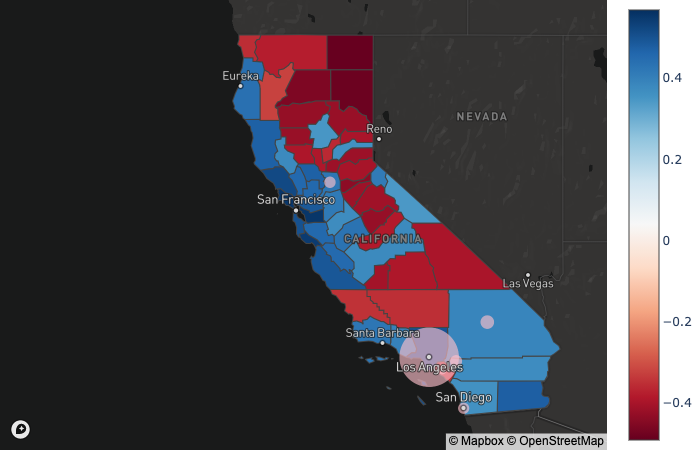
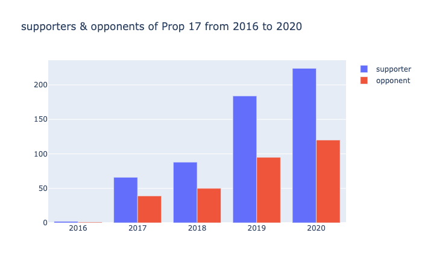

# README
### California Elections 2020, Prop 17 DataLab Challenge

*This is the main directory for data and support files related to the Prop 17 DataLab Challenge.*

### last updated: 10/4/20
### last update by: Carlos, Evan, Chenze

### Purpose/motivation
This repository contains example scripts for presenting prop 17 related illustrations. Replicating all statistical results require users to follow example readme instructions. We hope to tackle these questions: 
* What is the population of parolees in CA? Who are they and what is the nature of their crimes? What are their demographics?
* Which communities by county would see the most impact by parolee voting? And what is the partisanship of these counties?
* What will the impact of parolees be on the vote if Proposition 17 passes? What is ratio between the number of parolees and the number of population in California? * How will the ratio change?
* How do people feel about Proposition 17? Do they support it or oppose it?
* Did parolee enfranchisement in other states have any impact on voter turnout in their elections?

Description of approach

### Directory Manifest

*  Folders:
	* folder name - description of contents.
* folder name - description of contents.

* Files:
	*  filename - description of contents and dependencies. What does     this file represent, and how does it fit in the workflow?
  ### California major parole populations and county partisanship
  

*  filename - description of contents and dependencies.
  ### Support for Prop 17 via Youtube Crawl
  

### Personnel/Contributors

* full names and contact information of all persons involved in the project and their role.

### Project URLs - (for example: to data sources you used for the project)

* http://
* http://

### Project Repositories

* Item name: https://
* Item name: https://

