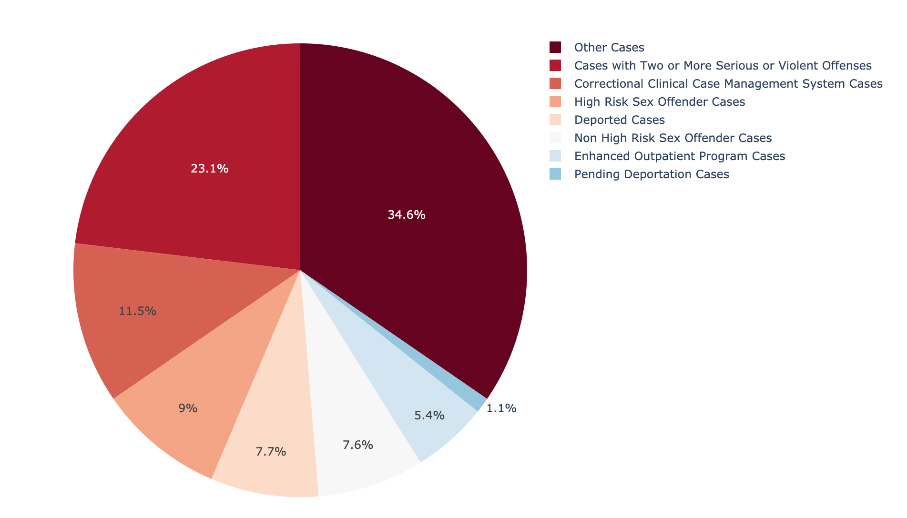
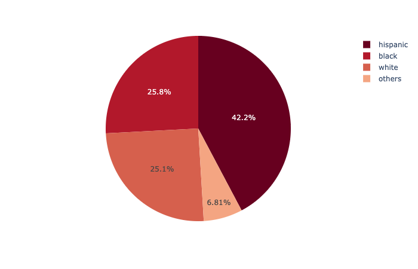
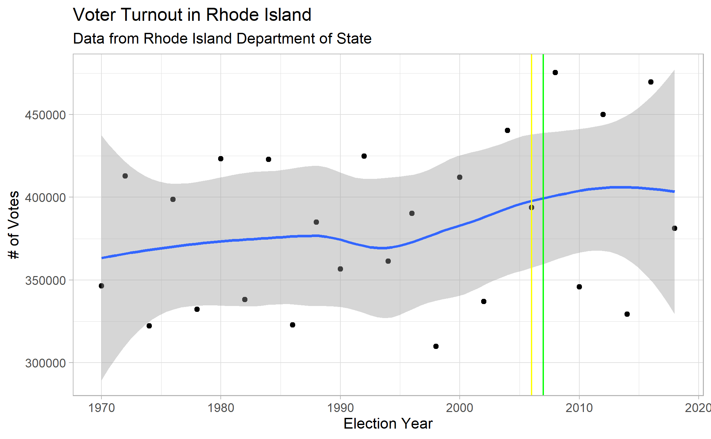
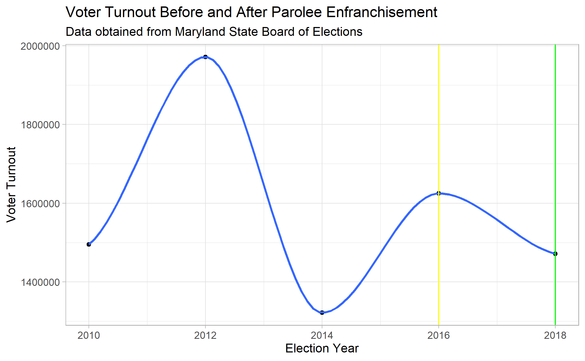

## Parole population and majority county party affiliation 
* see /parolee_population_voting_registration_map (directory) 

## Parole age demographic
* see /parolee_age_piechart (directory) 

## Parole agent caseload piechart
* see /parolee_agent_caseload_piechart (directory) 
| 

## Parole ethnicity demographic
* see /parolee_ethnicity_piechart (directory) 

## States that have passed prop 17 vote participation 
* see /Voter_Turnout_In_RI_and_MD (directory) 

## Estimate of prop 17 support form Youtube API
* see /supporters&opponents of Prop 17 in CA (directory) 

## Ratio and absolute number of parolees changes
* see /ratio and absolute number of parolees in CA (directory)

